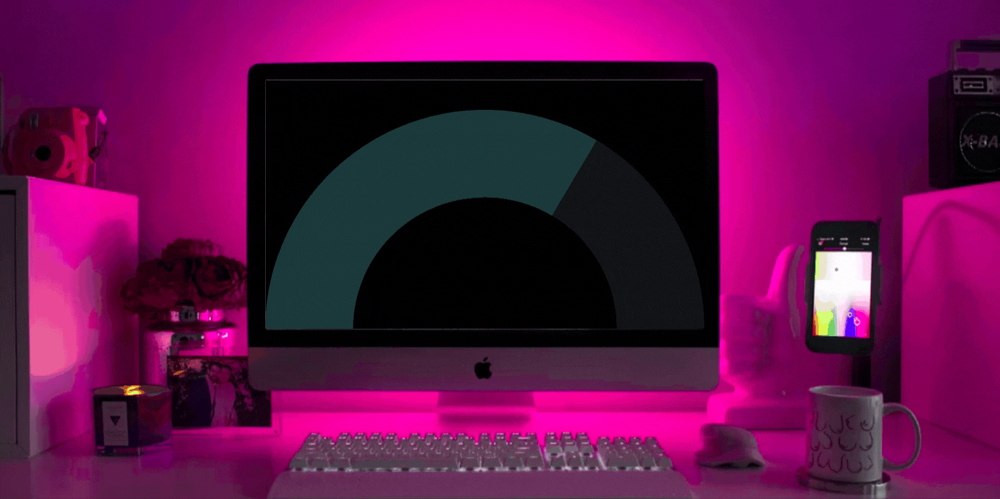

<!-- https://yhype.me/dashboard  -->

## Hi there 👋

My name is Paulo Pinheiro. I'm an Entry-Level Data Professional from Brazil exploring Data Analysis, Science, and Engineering using Python as a primary programming language.

<!-- links externos -->

  
  
  
  

- 💆‍♂️ I'm currently working on my **mental health** and **web scraping** relaxing projects.
- 🌱 I'm currently learning **Apache Airflow** & **Docker**.
- ⚡ Fun fact: ❤️ 🐕 my dogs | 🏐 volley | 🏖️ 😎 beach | 🍻 beer | 🍷 wine

  
  

## Tools

  
  
  
  
  
  

